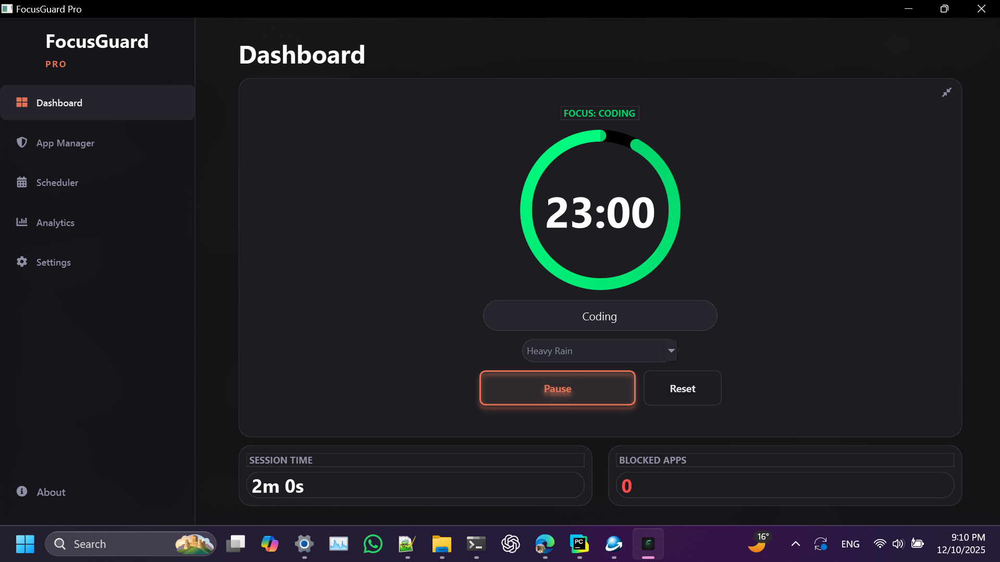
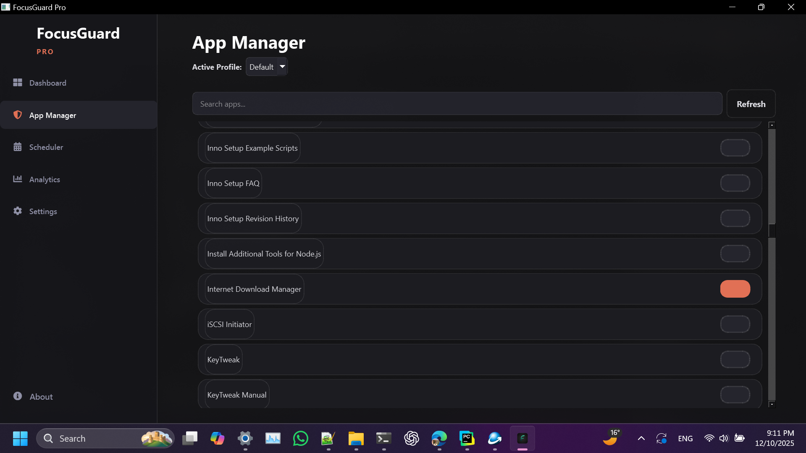
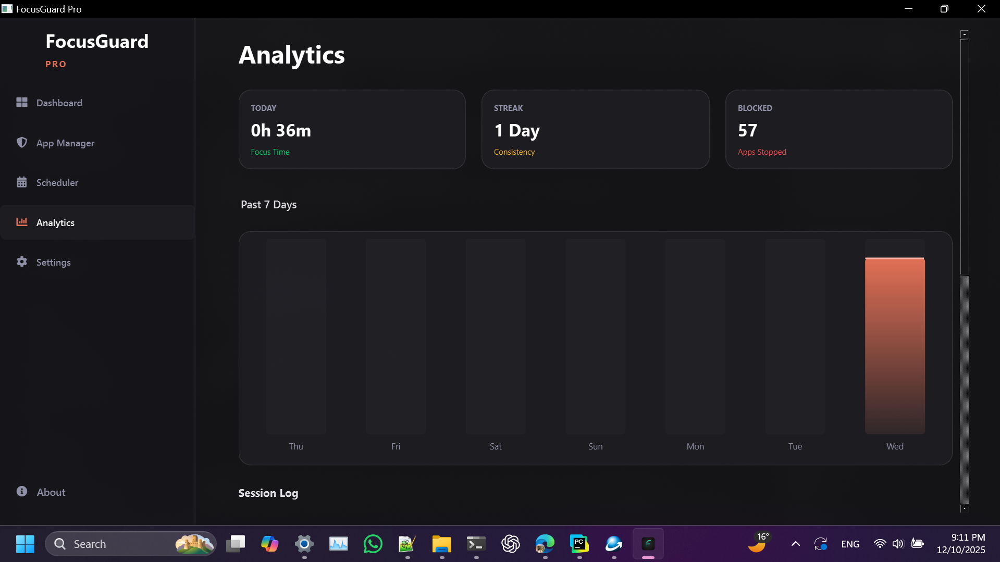

# FocusGuard Pro 🛡️

**The ultimate productivity companion for Windows.**

FocusGuard Pro combines a powerful distraction blocker, a Pomodoro-style timer, and deep analytics into a stunning, modern interface featuring the Windows Acrylic (Glass) aesthetic.

  

---

## 📥 Download & Installation

**Simply download the installer:**

1.  Go to the **[Releases Page](https://github.com/MustafijRatul/FocusGuardRepo/releases)**.
2.  Download the latest file: **`FocusGuard_Pro_Setup_v11.6.exe`**.
3.  Run the installer and follow the on-screen instructions.
4.  FocusGuard Pro will launch automatically and minimize to your system tray.

---

## 🖼️ Screenshots

### **Dashboard**
*Track your current session, manage focus/break timers, and control ambient sounds.*


### **App Manager**
*Selectively block distracting applications with custom profiles.*


### **Analytics**
*Visualize your productivity streaks and history over the last 7 days.*


---

## ✨ Key Features

### 🚀 **Productivity Engine**
*   **Smart Focus Timer:** A stunning circular timer supporting Focus and Break intervals.
*   **Task Intent:** Log exactly what you are working on before every session.
*   **Mini Mode:** A compact, always-on-top overlay to keep you aware of the time without cluttering your screen.

### 🚫 **Advanced App Blocking**
*   **Profile Management:** Create blocking profiles (e.g., "Deep Work", "Light Study") with specific app blocklists.
*   **Strict Mode:** Optionally force-kill distracting processes instead of just minimizing them.
*   **Smart Detection:** Automatically detects running windows and installed apps for easy selection.

### 📊 **Analytics & History**
*   **Interactive Charts:** View your focus performance over the last 7 days.
*   **Session Logs:** Detailed history of every session, including task names and duration.
*   **KPIs:** Track your daily focus time, streaks, and total distractions blocked.

### 🎨 **Modern UI/UX**
*   **Glass/Acrylic Effect:** Native Windows background blur integration.
*   **Theme Engine:** Switch between **Ambient** and **Dark** modes.
*   **Customization:** Choose from 6 neon accent colors and 3 button styles (Gradient, Solid, Glass).

### 🎵 **Ambient Soundscapes**
*   Built-in audio engine playing Rain, Jungle, and Thunder sounds.
*   Support for uploading your own custom background music.

---

## ⚙️ Configuration

FocusGuard Pro saves your preferences locally.
*   **System Tray:** The app minimizes to the system tray. Double-click the tray icon to restore the window, or right-click to Quit.
*   **Auto-Start:** You can enable "Run on Startup" in the Settings tab.

---

## 👨‍💻 For Developers (Run from Source)

If you want to contribute or run the raw Python version, follow these steps:

### Prerequisites
*   Windows 10 or 11.
*   Python 3.10+.

### 1. Clone the Repository
```bash
git clone https://github.com/MustafijRatul/FocusGuardRepo.git
cd FocusGuardRepo
```

### 2. Install Dependencies
```bash
pip install PySide6 qtawesome pygetwindow pygame matplotlib
```

### 3. Run the App
```bash
python main.py
```

### Building the EXE (Optional)
To create your own standalone executable using PyInstaller:
```bash
pyinstaller --noconsole --onefile --icon=icon1.png --name="FocusGuardPro" --add-data="icon1.png;." --add-data="*.wav;." --add-data="*.mp3;." main.py
```

---

## 🤝 Contributing

Contributions are welcome!
1. Fork the repository.
2. Create a new branch (`git checkout -b feature/NewFeature`).
3. Commit your changes.
4. Push to the branch and open a Pull Request.

---

## 👨‍💻 Author

**Md. Mustafijur Rahman Ratul**
*   [GitHub](https://github.com/MustafijRatul)
*   [Facebook](https://www.facebook.com/share/1BsBPTF5DK/)

---

*This project is for educational and productivity purposes.*
